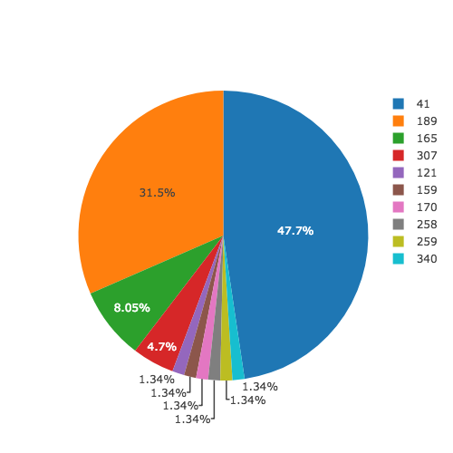
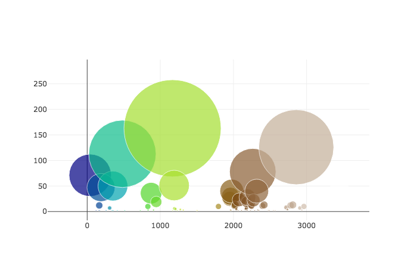
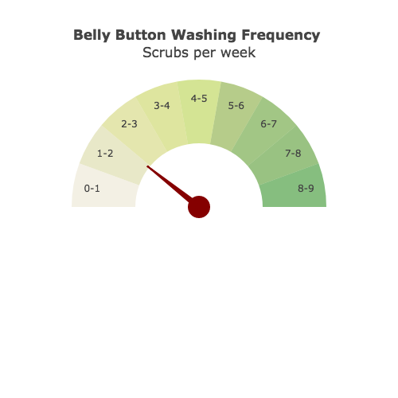

# Interactive-Dashboard

In this assignment, objective was to build an interactive dashboard to explore the Belly Button Biodiversity DataSet.

Step 1 - Plotly.js
Using Plotly.js, to build interactive charts for the dashboard.
  
  * Display the sample metadata from the route (/metadata/<sample>).
  * Display each key/value pair from the metadata JSON object on the page.
  * Create a PIE chart that uses data from samples route (/samples/<sample>) to display the top 10 samples.
  
  
  
  *	Create a Bubble Chart that uses data from your samples route (/samples/<sample>) to display each sample.
  
  
  
  * Create Gauge Chart  to plot the Weekly Washing Frequency obtained. 
  
  
   * Update all of the plots any time that a new sample is selected.

Step 2 - Heroku
  
  Deployed Flask app to Heroku at the following link: https://bb-bio-1234.herokuapp.com/ 
